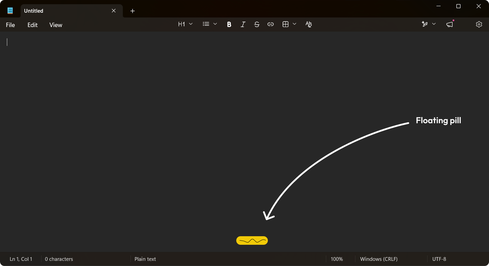
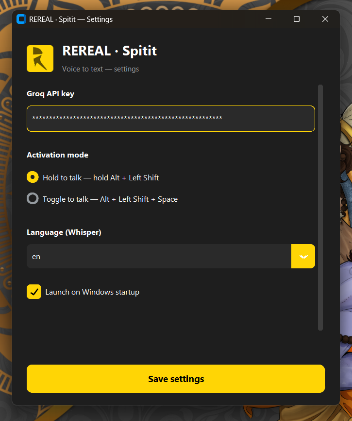

# REREAL - Spitit

<p align="center">
  
</p>

<p align="center">
  <strong>Speak. Release. Done.</strong>
</p>

<p align="center">
  <a href="https://github.com/VIKAS-REREAL/REREAL-Spitit/releases/latest">
    
  </a>
  
  
  
</p>

---

## What is Spitit?
**REREAL - Spitit** is a high-performance voice-to-text utility designed for seamless productivity. By leveraging Groq's lightning-fast Whisper implementation, Spitit transcribes your speech instantly and pastes it directly into your active window. No more typing—just spit it out.

---

## 📥 Download

Choose your preferred version below:

### 🌟 Recommended (Stable Installer)
Best for most users. Includes a full setup wizard and automatic updates.
[](https://github.com/VIKAS-REREAL/REREAL-Spitit/raw/main/dist_installer/REREAL-Spitit-Setup-1.1.0.exe)

### 🚀 Latest (Portable)
No installation required. Run directly from the `.exe`.
[](https://github.com/VIKAS-REREAL/REREAL-Spitit/releases/latest/download/REREAL-Spitit.exe)

---

## 📸 Screenshots
<p align="center">
  
  
</p>

---

## ✨ Features
-   **Global Hotkeys**: Record anytime, anywhere with system-wide shortcuts.
-   **Groq Whisper API**: Instant, accurate transcription powered by AI.
-   **Auto-Paste**: Transcribed text is automatically injected into your current application.
-   **Sleek Dark UI**: A modern, premium interface built with CustomTkinter.
-   **System Tray Integration**: Stays out of your way in the background.

---

## ⌨️ Hotkeys
| Action | Hotkey |
| :--- | :--- |
| **Hold to Talk** | `Alt + LShift` |
| **Toggle Recording** | `Alt + LShift + Space` |

---

## 🔑 Getting a Groq API Key
1.  Visit the [Groq Console](https://console.groq.com/keys).
2.  Create a free account or sign in.
3.  Generate a new API Key.
4.  Paste it into the Spitit settings window.

---

## 🛠️ Developer Setup
If you want to run from source:

```bash
# Clone the repository
git clone https://github.com/VIKAS-REREAL/REREAL-Spitit.git
cd REREAL-Spitit

# Install dependencies
pip install -r requirements.txt

# Run the app
python main.py
```

### Build from Source
To build the `.exe` yourself:
```bash
pyinstaller REREAL-Spitit.spec
```

---

## 🤝 Contributing
We welcome contributions! Please see our [CONTRIBUTING.md](CONTRIBUTING.md) for details on how to get started.

## 📄 License
This project is licensed under the MIT License - see the [LICENSE](LICENSE) file for details.

---

<p align="center">
  Built under <strong>REREAL</strong> — <em>Where real meets unreal</em>
</p>
